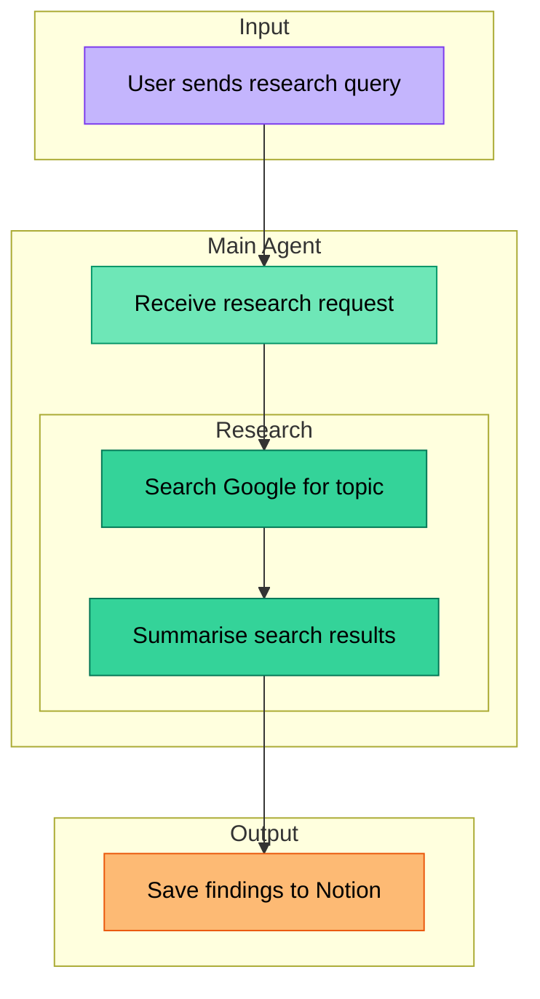
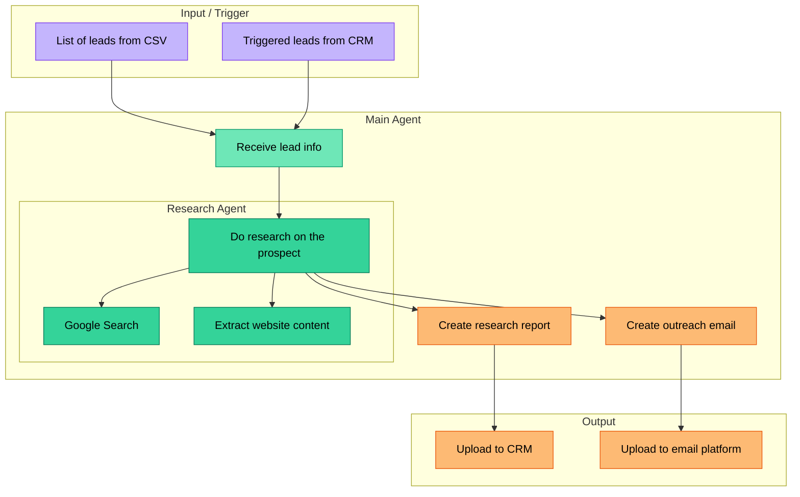
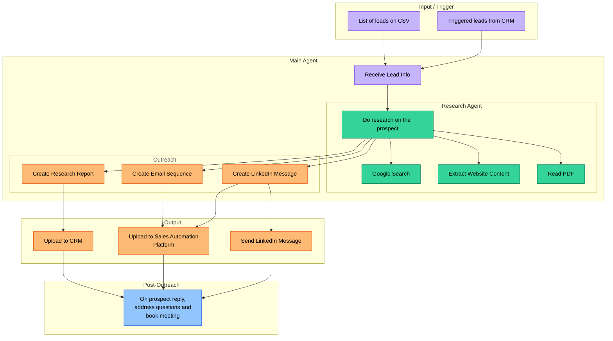

# Mermaid Conventions for Relevance AI Diagrams

Standardized mapping from Relevance AI concepts to Mermaid shapes. Used as the transient intermediary format for FigJam generation via the Figma MCP `generate_diagram` tool.

**Important:** the Mermaid is not persisted. The FigJam file is the canonical artifact.

---

## Design Principles

1. **Top-down flow always.** Use `graph TD` for all diagrams (single agents and workforces). Vertical hierarchy reads naturally.
2. **Subgraphs as swim lanes.** Group nodes by phase / function (Input / Trigger, Research, Actions, Output / Integrations). Name sections by what they DO, not what they ARE.
3. **Color code by function.** Every node gets a color based on its role (see palette below). This is not optional. It's the primary visual cue.
4. **Action-oriented labels.** Use descriptive text that explains what the node DOES: "Search Google for prospect info" not just "Google Search". Squares with clear text, no fancy shapes.
5. **Simple connectors.** Plain arrows (`-->`), no labels on edges unless the routing is ambiguous. The flow should be obvious from the layout.
6. **Nested subgraphs for sub-agents.** When an agent delegates to tools or sub-agents, nest them inside the parent's subgraph.
7. **All nodes are rectangles.** Use `["Text"]` for everything. Consistency over shape variety. The color does the differentiation.

## Color Palette (mandatory)

Every node must be styled. Use these colors consistently:

```
%% Triggers / Inputs -- Purple / Lilac
style node fill:#C4B5FD,stroke:#7C3AED,color:#000

%% Agents / Core steps -- Green
style node fill:#6EE7B7,stroke:#059669,color:#000

%% Tools / Research -- Darker Green
style node fill:#34D399,stroke:#047857,color:#000

%% Actions / Outputs -- Orange
style node fill:#FDBA74,stroke:#EA580C,color:#000

%% Integrations / External -- Orange (same as outputs, they are actions)
style node fill:#FDBA74,stroke:#EA580C,color:#000

%% Post-processing / Follow-up -- Blue
style node fill:#93C5FD,stroke:#2563EB,color:#000
```

| Function | Color | When to use |
|----------|-------|-------------|
| Trigger / Input | Purple (`#C4B5FD`) | Entry points: webhooks, CSV uploads, CRM triggers |
| Agent / Core step | Green (`#6EE7B7`) | Agent nodes, main processing steps |
| Tool / Research | Darker Green (`#34D399`) | Tools the agent calls: search, scrape, enrich |
| Action / Output | Orange (`#FDBA74`) | Write operations: create email, generate report, save to DB |
| Integration / External | Orange (`#FDBA74`) | External systems: CRM, Notion, Slack, email platforms |
| Follow-up / Post-process | Blue (`#93C5FD`) | Reply handling, monitoring, post-outreach |

## Subgraph Conventions

Subgraphs represent **phases / swim lanes**, not just groupings:

- **Input / Trigger** -- how data enters the system
- **Main Agent** -- the core processing (nest sub-agents / tools inside)
- **Research** (nested) -- tools that gather information
- **Actions** -- what the agent produces (emails, reports, messages)
- **Output / Integrations** -- where results go (CRM, Notion, email platform)
- **Post-Processing** -- follow-up, reply handling

## Syntax Rules (Figma MCP requirements)

These rules are enforced by the Figma `generate_diagram` tool:

1. **All text in quotes.** Shape labels and edge labels must be quoted (e.g., `["Text"]`, `-->|"Edge"|`)
2. **No emojis.** The tool rejects emoji characters
3. **No `\n` newlines.** Use `<br>` inside quoted text if line breaks are needed
4. **Supported diagram types only:** `graph`, `flowchart`, `sequenceDiagram`, `stateDiagram`, `stateDiagram-v2`, `gantt`
5. **Always use `TD` direction.** Top-down for all diagrams
6. **Color styling is mandatory.** Style every node per the palette above
7. **Simple arrows only.** Use `-->` for flow, no labels unless routing is ambiguous

---

## Example Templates

### Single Agent



### 2-Agent Workforce



### Full Pipeline


